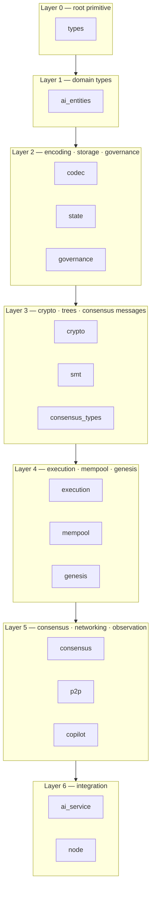
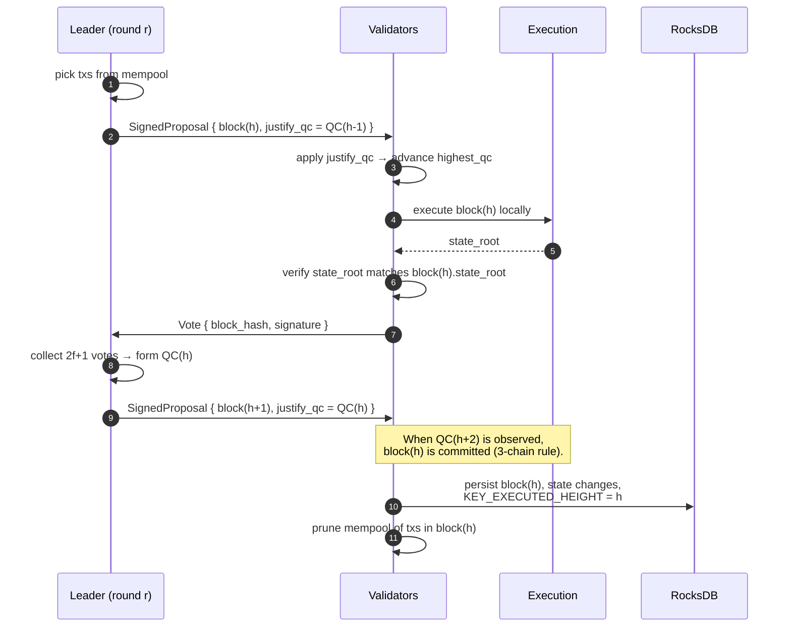
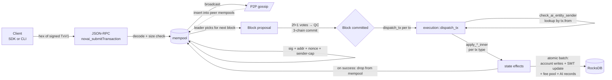

# NOVAI Architecture

A crate-by-crate walkthrough of how the NOVAI node is built, plus diagrams of the two flows that matter most: how blocks get committed (consensus), and how a single transaction travels from a client to persisted state (tx lifecycle).

If this is your first time on the codebase, read top-to-bottom: the layered diagram in [Crate dependency map](#crate-dependency-map) tells you which crates can be ignored when reading any given file (anything in a higher layer can't be a dependency).

---

## Overview

NOVAI is a Rust L1 blockchain organized as a Cargo workspace of 16 chain crates. Each crate has a narrow responsibility; everything composes upward toward `crates/node/`, which is the binary you run.

Three properties shape the architecture:

1. **Determinism is non-negotiable.** Every byte that touches state — payload encodings, hash inputs, SMT keys, signature domains — is canonical and tested with golden vectors. No floats, no nondeterministic iteration. The codec, crypto, smt, and execution crates all enforce this at API boundaries.
2. **Safety is layered, not monolithic.** Mempool validates signatures and address derivation. Consensus checks 2f+1 votes and the 3-chain commit rule. Execution validates per-tx invariants (nonce, fee minimum, capability flags) and uses atomic batches so a failure mid-tx leaves no partial state.
3. **AI entities are protocol primitives, not smart contracts.** A first-class on-chain identity holds its own balance, signs its own transactions, owns memory objects, and publishes signals. The `ai_entities`, `execution`, and `governance` crates encode this at the type level, not as a contract layer on top.

The full devnet boots with `./scripts/devnet.sh` — four `crates/node` validators wired to localhost, each running every subsystem described below.

---

## Crate dependency map

The arrows show "Layer N may depend on Layer N−1 or below". Within a layer, crates are siblings — none depends on the others in the same row. The per-crate sections below list the actual workspace dependencies; the layering is conservative (some crates only depend on a subset of the layers below).

---

## Layer 0 — root primitive

### `types`

**Purpose.** Core protocol value types every other crate references. The "root" of the dependency graph — depends on nothing else in the workspace.

**Key items.** `Address` (= `[u8; 32]`), `TxId`, `Hash32`, `SignatureBytes`, `TxV1`, `TxVersion`, `MAX_TX_SIZE` (128 KiB), `MAX_BLOCK_SIZE`, `MAX_PAYLOAD_SIZE`. The `TxV1` struct is 149-byte canonical: `[version:1][from:32][pubkey:32][nonce:8 LE][fee:8 LE][payload_len:4 LE][payload:N][sig:64]`.

**Workspace deps.** none.

**Where to read.** `crates/types/src/lib.rs` — the whole crate is one short file.

---

## Layer 1 — domain types

### `ai_entities`

**Purpose.** First-class on-chain types for AI entities, signals, memory objects, approval gates, action tiers, and NNPX privacy commitments. Pure type definitions plus the deterministic id derivations and capability bitfields.

**Key items.** `AiEntity`, `AiEntityId`, `CodeHash`, `AutonomyMode` (Advisory / Gated / Autonomous-reserved), `Capabilities` (bitfield), `MemoryObject`, `MemoryObjectType`, `AiSignalType` (7 variants), `SignalCommitment`, `ApprovalGate`, `GateType` (Multisig / Threshold / TimelockOnly), `DerivedView`. The `AiEntity::compute_id(code_hash, creator)` function is the canonical entity-id derivation: `blake3("NOVAI_AI_ENTITY_ID_V1" || code_hash || creator)`.

**Workspace deps.** `types`.

**Where to read.** `crates/ai_entities/src/lib.rs:1–50` for the module overview, then `signals.rs`, `gates.rs`, `memory.rs`, `privacy.rs`, `derived_views.rs` for each subsystem.

---

## Layer 2 — encoding · storage · governance

### `codec`

**Purpose.** Canonical binary encoding/decoding for every type that touches consensus or storage — transactions, blocks, governance proposals, AI entities, signal commitments, approval gates. Every encoding has a golden-vector test in `tests/golden_vectors/`.

**Key items.** `CodecError`, `encode_tx_v1_unsigned` / `encode_tx_v1_signed`, `txid_v1`, `decode_block_v1`, `encode_proposal_v1`, `encode_ai_entity_v3`, `encode_signal_commitment_v1`, `encode_approval_gate_v1`. The `txid_v1` function is `blake3(unsigned_tx_bytes)` — also used as the signing pre-image when prefixed with `"NOVAI_TX_V1"`.

**Workspace deps.** `types`, `ai_entities`.

**Where to read.** `crates/codec/src/lib.rs:1–25` for the error type and the unsigned-tx encoder. `ai_entity_codec.rs`, `ai_signal_codec.rs`, `gate_codec.rs` for the AI-side encodings.

### `state`

**Purpose.** State-DB abstraction. Defines the `Kv` (read) and `KvBatch` (atomic write) traits, all canonical key prefixes, and the on-disk record encodings (`AccountStateV1`, `FeePoolV1`, etc.). Independent of any specific backend — `crates/node` plugs in RocksDB; tests use an in-memory `MemKv`.

**Key items.** `Kv`, `KvBatch`, `WriteOp` (`Put` / `Delete`), `MemKv`, `AccountStateV1`, `FeePoolV1`, `account_key`, `ai_entity_key`, `ai_entity_by_address_key`, `ai_signal_key`, `ai_memory_object_key`, `KEY_SMT_ROOT`, `KEY_FEE_POOL`, `KEY_EXECUTED_HEIGHT`, `KEY_PREFIX_*` family.

**Workspace deps.** none.

**Where to read.** `crates/state/src/lib.rs` — all key prefixes and helper functions live in one file.

### `governance`

**Purpose.** Governance proposal lifecycle: types, state machine, timelock enforcement, codec. Proposal *execution* (i.e. the state changes a passed proposal effects) lives in `execution`, not here.

**Key items.** `Proposal`, `ProposalState` (Pending / Approved / Executed / Expired / Rolled-back), `ProposalType`, `GovernanceConfig`, `encode_proposal_v1`, `decode_proposal_v1`.

**Workspace deps.** `types`.

**Where to read.** `crates/governance/src/lib.rs:1–50` for the config and lifecycle struct, `codec.rs` for the wire encoding.

---

## Layer 3 — crypto · trees · consensus messages

### `crypto`

**Purpose.** Ed25519 signing and verification with NOVAI's domain-separation conventions, address derivation, and ZK verifier hooks (currently stubbed for `Autonomous` autonomy mode).

**Key items.** `generate_keypair`, `address_from_pubkey` (= `blake3("NOVAI_ADDRESS_V1" || pubkey)`), `sign_tx_v1`, `verify_tx_v1`, `sign_bytes`, `verify_bytes`, `pubkey_from_bytes`, `ZkVerifier` trait, `StubZkVerifier`. All signing is detached and prefixed with `b"NOVAI_TX_V1"` to prevent cross-domain reuse.

**Workspace deps.** `types`, `codec`.

**Where to read.** `crates/crypto/src/lib.rs:19–80`. The doc-comment at the top spells out the domain tags.

### `smt`

**Purpose.** Sparse Merkle Tree: the consensus-critical accumulator that turns the account state into a single 32-byte root. Domain-separated leaf and internal hashes, deterministic ordering, fixed pre-computed empty-subtree hashes per height.

**Key items.** `Smt`, `SmtStore`, `Node`, `NodeChild`, `SmtError`, `hash_leaf`, `hash_internal`, `empty_hash_at_height`. Node encoding is exactly 67 bytes (1 tag + 2 × 32 + 2 height bytes); leaves and internal nodes share the same wire shape. Domain tags: `b"NOVAI_SMT_LEAF_V1"` and `b"NOVAI_SMT_INTERNAL_V1"`.

**Workspace deps.** `state`.

**Where to read.** `crates/smt/src/lib.rs:1–42` for the module overview, then `smt.rs` for the apply/lookup logic and `hash.rs` for the domain-separated hashers.

### `consensus_types`

**Purpose.** The wire types for the consensus layer: blocks, proposals, votes, quorum certificates, timeouts. Every message has a canonical encoding plus golden-vector tests. Includes the deterministic leader-rotation function.

**Key items.** `Block`, `Proposal`, `SignedProposal`, `Vote`, `QC`, `Timeout`, `MessageKind`, `LeaderRotation`, `block_hash`, `encode_block_v1`, `encode_signed_proposal_v1`. The `Block` struct contains height, round, parent hash, state root, and the tx vector — what the leader proposes and validators verify.

**Workspace deps.** `types`, `codec`.

**Where to read.** `crates/consensus_types/src/lib.rs:1–50` for the message structs, `codec.rs` for encodings, `leader.rs` for round-robin rotation.

---

## Layer 4 — execution · mempool · genesis

### `execution`

**Purpose.** The deterministic state-transition engine. Decodes payloads, runs every per-tx validation, applies state changes via atomic batches, and updates the SMT. The `dispatch_tx` function is the single entry point — every transaction in every block goes through it.

**Key items.** `dispatch_tx`, `apply_tx_v1_transfer{,_inner}`, `apply_signal_commitment_tx{,_inner}`, the four `apply_*_memory_object_tx` variants, `apply_register_ai_entity_{tx,with_key_tx}`, `apply_credit_ai_entity_tx`, `apply_governance_{submit,execute}_tx`, `check_ai_entity_sender`, `lookup_ai_entity_by_address`, plus all 10 payload `encode_*_v1`/`decode_*_v1` pairs and their `*_PAYLOAD_V1` byte constants.

**Workspace deps.** `types`, `state`, `smt`, `ai_entities`, `codec`, `governance`.

**Where to read.** `crates/execution/src/lib.rs` is the workhorse — single ~5000-line file. Start at `dispatch_tx` (~line 3437) to see the routing table; follow into `apply_*_inner` for the per-tx-type logic. The transfer path at line 1071 is the cleanest reference for how an AI-entity sender is threaded through.

### `mempool`

**Purpose.** A simple FIFO transaction pool with per-sender caps, signature verification on insert, and address-derivation enforcement. The mempool is the only place where signatures are checked outside the genesis path; consensus-layer code trusts that everything from the mempool has a valid sig.

**Key items.** `Mempool`, `TxMempoolError`, `MAX_PENDING_PER_SENDER`. On insert: validates that `tx.from == address_from_pubkey(tx.pubkey)`, the signature verifies against the domain-tagged unsigned bytes, the tx fits the size cap, and the per-sender count limit isn't exceeded.

**Workspace deps.** `types`, `codec`, `crypto`.

**Where to read.** `crates/mempool/src/lib.rs:1–100` covers the struct and the insert path; the validation at `lib.rs:280–315` is where every tx that ever lands in a block first passes through.

### `genesis`

**Purpose.** Parses `genesis.json` (validator set, pre-funded accounts, AI entities, params) and writes the initial state into a fresh DB so every node boots from byte-identical state. Computes the genesis SMT root that the first proposed block's `parent_hash` chains to.

**Key items.** `GenesisConfig`, `GenesisError`, `genesis_state`, `initialize_state`. The output is a (state_root, validator_set, parameters) triple that becomes the chain's anchor.

**Workspace deps.** `types`, `crypto`, `state`, `smt`, `consensus_types`, `ai_entities`, `codec`.

**Where to read.** `crates/genesis/src/lib.rs:1–50` for the config schema; `devnet/genesis.json` and `mainnet/genesis.json` for real configs.

---

## Layer 5 — consensus · networking · observation

### `consensus`

**Purpose.** The HotStuff-like BFT engine: handles incoming proposals and votes, forms QCs once 2f+1 votes arrive, applies the 3-chain commit rule to finalize blocks, and triggers timeouts/round advances. Pure state-machine logic — no I/O, no networking; the node binary feeds it events and consumes the resulting actions.

**Key items.** `ConsensusEngine`, `ConsensusState`, `BASE_TIMEOUT_MS`, `TIMEOUT_MULTIPLIER`, `MAX_TIMEOUT_MS`, `CACHE_RETAIN_DEPTH`, `verify_block`, `handle_proposal`, `handle_vote`, `handle_qc`, `handle_timeout`, `try_commit`. The 3-chain rule is encoded in `try_commit`: once the engine sees `QC(h+2)`, the block at height `h` is finalized and its execution effects are persisted.

**Workspace deps.** `types`, `consensus_types`, `crypto`, `codec`, `execution`, `state`, `mempool`.

**Where to read.** `crates/consensus/src/lib.rs:1–50` for the config; the proposal/vote/QC handlers form the core. Crash-safe persistence and the "executed_height" pointer (`KEY_EXECUTED_HEIGHT` in `state`) are what make node restart recovery work.

### `p2p`

**Purpose.** Minimal TCP transport for consensus message gossip. Noise-encrypted (`Noise_XX_25519_ChaChaPoly_SHA256`), length-prefixed wire format, no DHT or peer discovery beyond the static peer list passed at startup. Deliberately small — anything fancier (DHT, kademlia, NAT traversal) is out of scope until testnet.

**Key items.** `MessageKind` (proposal / vote / qc / timeout / tx-broadcast / block-request / block-response), `P2pNetwork`, the wire format `[len:4 LE][version:1][kind:1][payload]`.

**Workspace deps.** `consensus_types`.

**Where to read.** `crates/p2p/src/lib.rs:1–50` for the message kinds, `transport.rs` for the framing, `noise.rs` for the handshake.

### `copilot`

**Purpose.** Statistics-based anomaly detection and congestion forecasting. Pure observation — collects stats per block and emits *advisory* signals (`Anomaly`, `CongestionForecast`, `SpamRisk`). Cannot mutate state; the "Rail A / Rail B" split keeps deterministic chain logic separate from heuristic AI logic.

**Key items.** `ChainStats`, `RingBuffer`, `AnomalyDetector`, `CongestionForecaster`, `CongestionLevel`, `SpamDetector`, `Reporter`. Statistics are integer-only for determinism even though the output signals are advisory.

**Workspace deps.** `types`, `ai_entities`, `crypto`.

**Where to read.** `crates/copilot/src/lib.rs:1–50` for the module overview, `stats.rs` and `congestion_stats.rs` for the data structures, `detector.rs` and `congestion_forecaster.rs` for the heuristics.

---

## Layer 6 — integration

### `ai_service`

**Purpose.** Optional Anthropic Claude API integration for off-chain LLM analysis ("Rail B" — non-deterministic, advisory-only, never feeds back into consensus). Used to enrich the copilot's signals with natural-language context. Disabled by default; enable with `NOVAI_AI_API_KEY`.

**Key items.** `AnthropicClient`, `AiServiceRunner`, `AiAnalysisResponse`, `FeatureFlags`, `PromptBuilder`, the bridge's circuit breaker.

**Workspace deps.** `ai_entities`, `copilot`.

**Where to read.** `crates/ai_service/src/lib.rs:1–38` for the module overview, `bridge.rs` for the circuit breaker that keeps a flapping API away from the chain, `scheduler.rs` for the rate-limited dispatch.

### `node`

**Purpose.** The integration crate. Owns the binary entrypoint (`crates/node/src/main.rs`), the long-running consensus task (`consensus_node.rs`), the JSON-RPC server (`rpc.rs`), and Prometheus metrics. Wires every other crate together, owns the RocksDB handle, and operates the `BlockchainIndex` that the RPC layer queries for tx receipts and block hashes.

**Key items.** `ConsensusNode`, `BlockchainIndex`, `MutexExt` (poison-recovery helper), `metrics` module, the RPC handler functions (`handle_submit_tx`, `handle_get_balance`, etc.). The `main.rs` parses CLI flags, builds the keypair, opens RocksDB, and spawns the consensus + RPC + metrics tasks.

**Workspace deps.** every other crate listed above.

**Where to read.** `crates/node/src/main.rs` to see the boot sequence; `crates/node/src/consensus_node.rs` to see how `consensus`, `mempool`, and `execution` are stitched together; `crates/node/src/rpc.rs` for the 13 endpoints documented in [`docs/RPC_REFERENCE.md`](RPC_REFERENCE.md).

---

## Consensus flow

NOVAI runs HotStuff-style BFT with a 3-chain commit rule. The leader for round `r` proposes; validators vote; once the leader collects 2f+1 votes, it forms a QC; a block is committed once a QC chain three levels deep exists above it. Round-robin leader rotation and exponential backoff on timeout keep things live under partial network failures.

**Key safety properties.** No two committed blocks at the same height (would require 2f+1 honest validators to double-vote). No execution of a tx without a valid QC chain. Crash-safe: `KEY_EXECUTED_HEIGHT` pointer means an interrupted commit either fully landed or didn't, never partially.

**Files to read in order.** `crates/consensus/src/lib.rs` (the state machine) → `crates/node/src/consensus_node.rs` (the I/O loop that drives it) → `crates/state/src/lib.rs` (the persistence pointers).

---

## Transaction lifecycle

A single tx, end-to-end, from a client signing it to its effects landing on chain.

**What gets validated, where.**

| Stage | What's checked | What rejects |
|---|---|---|
| RPC | tx hex parses, size ≤ 256 KiB | `-32602` invalid params; `-32000` too large |
| Mempool | sig valid, `tx.from == addr(tx.pubkey)`, nonce monotonic for sender, fee ≥ minimum, sender cap | `TxMempoolError::*` (relayed as `-32000`) |
| Consensus | block well-formed, parent matches, leader is correct for round, QC valid | block rejected, vote withheld |
| Execution | per-tx-type invariants (entity capability, balance ≥ amount + fee, kill switch, etc.) | `ExecError::*` — tx dropped, others in block continue |

**Key files to read.** `crates/node/src/rpc.rs:handle_submit_tx` (the entry point) → `crates/mempool/src/lib.rs` (insert validation) → `crates/consensus/src/lib.rs` (block formation) → `crates/execution/src/lib.rs:dispatch_tx` (the apply loop). The [`docs/RPC_REFERENCE.md`](RPC_REFERENCE.md) doc details the RPC-layer error mapping; the SDK examples ([Rust](../sdk/novai-sdk/examples/quick-start/) / [TypeScript](../sdk/novai-sdk-ts/examples/quick-start/)) drive the full pipeline end-to-end.

---

## Tools and SDKs

These live outside `crates/` and are not part of the chain's deterministic surface, but they're how you actually interact with a node.

| Path | Purpose |
|---|---|
| `tools/novai-cli/` | The CLI — keygen, faucet, balance, transfer, register/credit AI entities, signal publish, memory CRUD, and queries. 17 commands. Detailed in [`docs/tutorials/FIRST_AI_ENTITY.md`](tutorials/FIRST_AI_ENTITY.md). |
| `tools/genesis-generator/` | Builds a `genesis.json` file from a higher-level config (validator pubkeys, pre-funded accounts, AI entity manifests). |
| `tools/tx-generator/` | Load-test driver that mints accounts and submits transfers in a loop. Used to tune mempool and consensus throughput. |
| `sdk/novai-sdk/` | Rust SDK: `Client`, key helpers, all 10 tx builders. Async via tokio. Quick-start in [`examples/quick-start/`](../sdk/novai-sdk/examples/quick-start/). |
| `sdk/novai-sdk-ts/` | TypeScript SDK: `NovaiClient`, key helpers, all 10 tx builders. Pure-JS deps (`tweetnacl` + `blake3`). Quick-start in [`examples/quick-start/`](../sdk/novai-sdk-ts/examples/quick-start/). |

---

## Where to start reading

Three suggested paths through the codebase, depending on what you came for.

**"I want to understand consensus."** Start with `crates/consensus_types/src/lib.rs` for the message vocabulary, then `crates/consensus/src/lib.rs` for the state machine, then `crates/node/src/consensus_node.rs` to see how it's driven by network events and committed blocks.

**"I want to add a new transaction type."** Start with `crates/execution/src/lib.rs` and look at how `apply_signal_commitment_tx` is structured — payload encoding, validation, atomic batch, dispatcher entry. Then `crates/codec/src/lib.rs` for the encoding pattern, and the existing `tests/signal_commitment_v1.rs` and `tests/entity_dispatch_e2e.rs` for the test shape.

**"I want to build a bot."** Start with [`docs/tutorials/FIRST_AI_ENTITY.md`](tutorials/FIRST_AI_ENTITY.md), then run [`sdk/novai-sdk-ts/examples/quick-start/`](../sdk/novai-sdk-ts/examples/quick-start/) or [`sdk/novai-sdk/examples/quick-start/`](../sdk/novai-sdk/examples/quick-start/), then read [`docs/RPC_REFERENCE.md`](RPC_REFERENCE.md) when you need an endpoint the SDK doesn't yet wrap.

---

## See also

- [`docs/CONSENSUS_V1.md`](CONSENSUS_V1.md) — formal consensus specification.
- [`docs/ARCHITECTURE_DECISIONS.md`](ARCHITECTURE_DECISIONS.md) — the "why" behind structural choices.
- [`docs/CLEANROOM_POLICY.md`](CLEANROOM_POLICY.md) — clean-room development rules and license enforcement.
- [`docs/SECURITY_MODEL.md`](SECURITY_MODEL.md) — threat model and trust assumptions.
- [`docs/tutorials/FIRST_AI_ENTITY.md`](tutorials/FIRST_AI_ENTITY.md) — 10-minute end-to-end CLI tutorial.
- [`docs/RPC_REFERENCE.md`](RPC_REFERENCE.md) — every JSON-RPC endpoint with examples.
